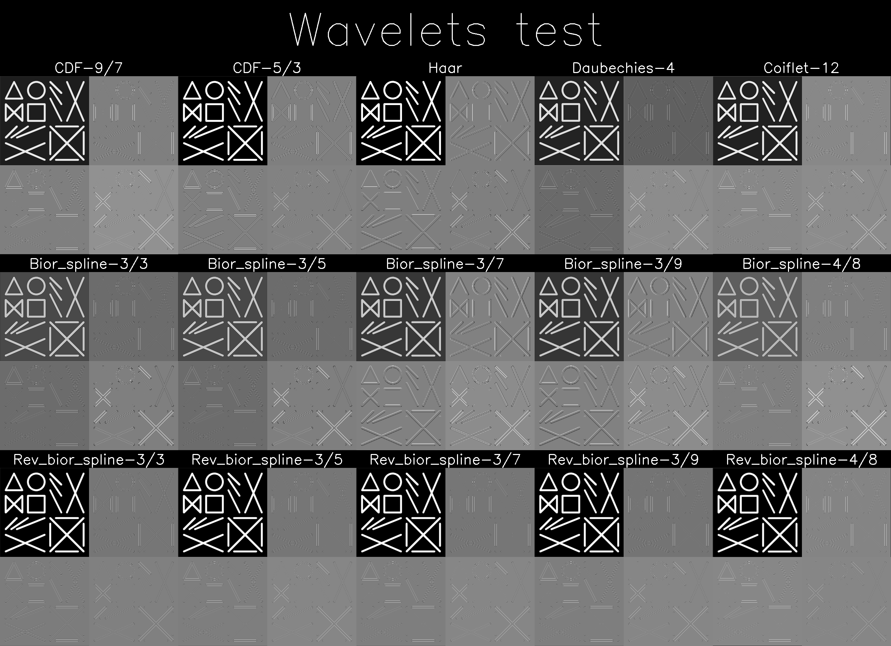
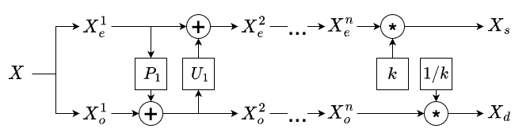
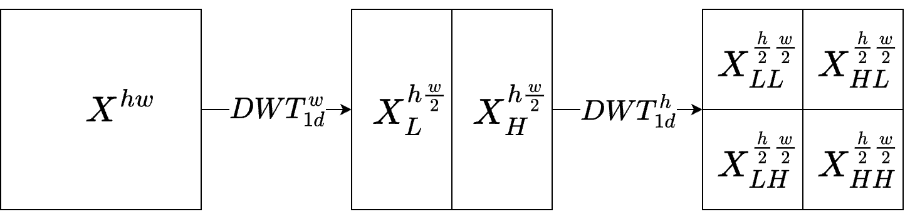

# Discrete wavelet transform (DWT) via lifting in PyTorch

This repository provides implementation of discrete wavelet transform (DWT) via lifting scheme in PyTorch.
Operations can run on both: CPU and GPU, filter coefficients can be made trainable parameters of model.
The following wavelets are implemented (15 in total):
1) CDF-9/7 (used in lossy compression in JPEG 2000)
2) CDF-5/3 (used in lossless compression in JPEG 2000)
3) Haar
4) Biorthogonal Spline Wavelets: 3/3, 3/5, 3/7, 3/9, 4/8
5) Reverse Biorthogonal Spline Wavelets: 3/3, 3/5, 3/7, 3/9, 4/8
6) Daubechies: 4
7) Coiflets: 12

All the schemes have been tested for perfect reconstruction, i.e, operations of analysis and synthesis are invertible: 
the error varies from approximately `1e-15` to `1e-14`.

This repository also has a TensorFlow port: https://github.com/uladzislau-varabei/tf-wavelet-lifting.

## Results 

Below are some of the results with all the implemented wavelets. See file `tests.py` for details.

Textures:

Some real world image sample:

## DWT lifting scheme

To get a better understanding of what lifting scheme for wavelets is, refer to the following image:

## DWT for images

Application of DWT to 2d input (images) can be summarized with the following figure:

The same approach is applied to each image channel and to each image in batch. 
The implementation in this repository is vectorized, that is, at the same time all columns or rows of input are used, 
so it's very fast. 

## Normalization

For 2d normalization the suggested coeffs are `[1 / sqrt(2) ** 2, 1, 1, sqrt(2)]`
They are set as default values, see `COEFFS_SCALES_2D_v6`. 
These values allow to preserve mean of abs values for LL coeffs and keep almost the same range for all H coeffs.
  Below are the results for `CDF-9/7` and normalized image `castle1_grayscale.png` (Q - quantile):

| Coeff |  Min   |   Max |   Mean | Mean abs |   Q=10 |  Q=90 |
|:------|:------:|------:|-------:|---------:|-------:|------:|
| Input |  -1.0  | 0.984 | -0.001 |    0.576 | -0.804 | 0.867 |
| LL    | -1.037 | 0.992 |  0.000 |    0.568 | -0.793 | 0.867 |
| LH    | -0.998 | 1.107 | -0.001 |    0.056 | -0.083 | 0.082 |
| HL    | -1.389 | 1.589 |  0.001 |    0.054 | -0.075 | 0.075 |
| HH    | -1.011 | 0.899 |  0.000 |    0.040 | -0.062 | 0.061 |

And here are the results for `CDF-9/7` and unnormalized image `castle1_grayscale.png` (Q - quantile):

| Coeff |   Min   |    Max |   Mean | Mean abs |    Q=10 |    Q=90 |
|:------|:-------:|-------:|-------:|---------:|--------:|--------:|
| Input |   0.0   |  253.0 | 127.37 |  127.367 |    25.0 |   238.0 |
| LL    |  -2.16  | 253.94 | 127.36 |  127.356 |  26.295 | 238.047 |
| LH    | -127.19 | 141.21 |  0.004 |    7.074 | -10.399 |  10.503 |
| HL    | -177.07 | 202.58 |  0.229 |    6.937 |  -9.545 |   9.565 |
| HH    | -128.92 | 114.56 | -0.026 |    5.042 |  -7.901 |   7.834 |

## Additional tests 

For clearer understanding of all the implemented wavelets it can be useful to see results on additional images. 
Such results are presented in the `results` directory. 
Original images for testing can be found in the `images` directory.

## Acknowledgements

For details on lifting schemes for different wavelets a special thank is for 
[Alex Malevich](https://scholar.google.com/citations?user=lQt-qqUAAAAJ&hl=eng).
